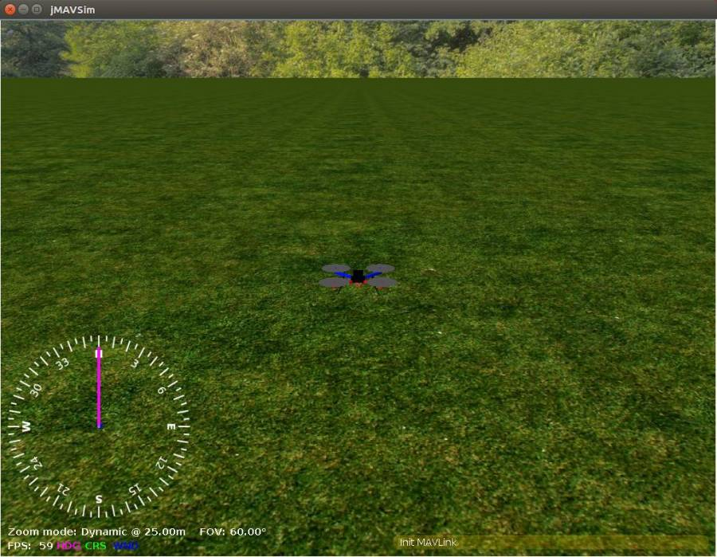

# Simulation of a Disturbance Observer-Based Integral Backstepping Controller with PX4 and SITL/jMAVSim


This repo contains the simulation code for the IFAC 2020 conference paper submission **'Disturbance Observer-Based Integral Backstepping Controller for Multirotor UAVs'**. 

The code simulates a disturbance observer-based integral backstepping control for a multirotor UAV running the [PX4 autopilot firmware](https://px4.io/). **SITL** (*Software in the loop*) is combined with the [jMAVSim](https://github.com/PX4/jMAVSim) simulator. The reason for using SITL simulation is to test controller performance using actual PX4 firmware. This ensures the controller is implementable on-board physical autopilots (e.g. Pixhawk 1, etc.) and that simulation results are closer to what are observed in flight testing. 

## Contents

* [Important Folders and Files](#important-folders-and-files)
  * [Usage](#usage)
    + [Installation](#installation)
      - [1. Installing the Toolchain](#1-installing-the-toolchain)
      - [2. Downloading the Code](#2-downloading-the-code)
    + [Running the SITL/jMAVSim Simulation](#running-the-sitljmavsim-simulation)
  * [Debug/Customize Controller](#debugcustomize-controller)
  * [Citing](#citing)
  * [Acknowledgement](#acknowledgement)

## Important Folders and Files

1. Folder containing the module which implements the backstepping controller: [mc_TASK](./src/modules/mc_TASK)

2. cmake config file for compiling the project: [posix_sitl_custom](./cmake/configs/posix.sitl_custom.cmake)

3. jMAVSim configuration for the controller: [simulator constructor](./Tools/jmavsim/src/me/drton/jmavsim/Simulator.java#L430)

## Usage

### Installation

**Note:** This code is developed on the **[PX4 (v1.5.5, Jan 25, 2017)](https://github.com/PX4/Firmware/releases/tag/v1.5.5)**, which is behind the current version of the firmware. Hence, the PX4 toolchain should be installed manually using the following steps. Note that this installation will only allow SITL simulation and not compilation for an actual autopilot such as Pixhawk 1. 

#### 1. Installing the Toolchain

* Perform a clean install of **Ubuntu 16.04** for your development environment. **Do not use** a more recent version of Ubuntu (e.g., 18.04) as it will not work. **Do not use** a VMWARE Workstation VM or Virtualbox VM to run your Ubuntu as it will not support jMAVSim.

* Update package list and install the PX4 build dependencies:

```
sudo add-apt-repository ppa:george-edison55/cmake-3.x -y
sudo apt-get update
sudo apt-get install python-argparse git-core wget zip python-empy qtcreator cmake build-essential genromfs -y
sudo apt-get install ant protobuf-compiler libeigen3-dev libopencv-dev openjdk-8-jdk openjdk-8-jre clang-3.5 lldb-3.5 -y
```

#### 2. Downloading the Code

The PX4 firmware depends on a number of other projects which are included as submodules. To clone the repo using HTTPS and init all the submodules, run:

```git clone --recursive https://github.com/ANCL/UAV_IBS.git```

Equivalently, you can do this in two steps with:

```
git clone https://github.com/ANCL/UAV_IBS.git
cd UAV_IBS
git submodule update --init --recursive
```

### Running the SITL/jMAVSim Simulation

1. In order to compile the PX4 code for SITL and and start jMAVSim:

```make posix_sitl_custom jmavsim```

When the build is successful, JMAVSim and the PXH shel are launched. In the terminal you should see

```
______  __   __    ___ 
| ___ \ \ \ / /   /   |
| |_/ /  \ V /   / /| |
|  __/   /   \  / /_| |
| |     / /^\ \ \___  |
\_|     \/   \/     |_/

px4 starting
...
INFO [tone_alarm] home_set
INFO [tone_alarm] neutral
pxh>

```

A separate jMAVSim window should launch which shows the quadrotor in a virtual world. You can begin flying once you have a position lock which is when PXH shell displays `gps init`.


2. Changing the flight mode. * There are two flying modes in our customized version of PX4: **ANCL1** and **ANCL2**.

* **ANCL1 mode**: This mode makes the quad hover at x=0, y=0, z=-1 which is 1 meter above the origin of the world.

* **ANCL2 mode**: This mode switches to the Disturbance Observer-Based Integral Backstepping Controller(reference trajectory is "figure 8").

The reason for having the **ANCL1** mode is to simplify actual flight testing of various trajectories where **ANCL1** provides an initial condition for other tractories defined in **ANCL2**.

```
commander mode ancl1
commander arm # arm the quad, make the quad hover at 1 meter height
commander mode ancl2 # change the mode to use backstepping control
```

## Debug/Customize Controller

If you run into any problems using the code, please open an [issue](https://help.github.com/en/github/managing-your-work-on-github/creating-an-issue), or you can email one of us:

* Alan F.Lynch <alan.lynch@ualberta.ca>
* Zhijun Xue <zxue2@ualberta.ca>
* Amir Moeini <moeini@ualberta.ca>

### 1. Debug the controller

There might be cases where you are developing/debug your controller and want to build without launching the simulator. You can start JMAVSim and PX4 separately:

```
./Tools/jmavsim_run.sh -l
make px4_sitl none
```

This allows a faster testing cycle (restarting jMAVSim takes significantly more time).

### 2. Change trajectory

**Beckstepping Controller**'s default reference trajectory is "**figure 8**". 

If you want to change the trajectory, you can go to [mc_TASK/BlockTASKController.cpp](./src/modules/mc_TASK/BlockTASKController.cpp#L138), and then change the parameter: ```switch_traj```to set your desired trajectory(e.g. circle, setpoint)

## Citing

## Acknowledgement
Thanks to the [PX4 team](https://px4.io/) for their open-source autopilot on which this code is based.

